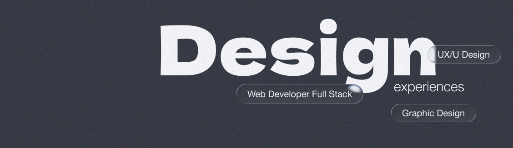

<div align="center">
  
# Hi, I'm Rebeca 👋🏻👩🏼‍💻

### Full Stack Developer • UX/UI Designer

*I transform ideas into functional and beautiful digital experiences.*  
*Combining clean code with intuitive design to create products that people actually want to use.*

[](https://www.linkedin.com/in/rebeca-diaz-montenegro-sanchez/)
[](mailto:rebecamontenegro.design@gmail.com)

</div>

---

## 🎨 About Me

I'm a full stack developer and UX/UI designer with a passion for creating interfaces that not only look great but solve real problems. I love that sweet spot where design and development meet: where aesthetics become code and functionality becomes art.
```javascript
const rebeca = {
  pronouns: "she/her",
  location: "Madrid, Spain 🇪🇸",
  role: ["Full Stack Developer", "UX/UI Designer"],
  code: ["JavaScript", "HTML", "CSS"],
  technologies: {
    frontend: ["React", "Vanilla.js", "SASS"],
    backend: ["Node.js", "Express"],
    databases: ["MongoDB", "PostgreSQL", "MySQL", "Firebase"],
    design: ["Figma", "Design Systems"],
    tools: ["Git", "Docker", "Vite", "Jest"]
  },
  currentFocus: "Building accessible and performant web applications",
};
```

---

## 🛠️ Tech Stack

<div align="center">

### Frontend


### Backend & Databases


### Tools & Design


</div>

---

## 💼 What I Do

<table>
<tr>
<td width="50%">

### 🎯 Full Stack Development
Building complete web applications from conception to deployment with modern technologies and best practices.

</td>
<td width="50%">

### 🎨 UX/UI Design
Creating intuitive interfaces based on user research, wireframing, prototyping, and design systems.

</td>
</tr>
<tr>
<td width="50%">

### 🔄 Design Systems
Developing scalable design systems and reusable component libraries for consistent user experiences.

</td>
<td width="50%">

### ⚡ Performance Optimization
Improving web performance, accessibility, and SEO to deliver exceptional user experiences.

</td>
</tr>
</table>

---

## 🌟 Work Philosophy

> **User-Centered Design + Scalable Code = Exceptional Digital Products**

- 🎯 **Design**: Mobile-first, accessible, and inclusive
- 💻 **Code**: Clean, documented, and scalable
- 📚 **Learning**: Constant and curious
- 🤝 **Collaboration**: Open and transparent

---

## 🚀 Featured Projects

### 🔗 [Internal Chatbot System](https://github.com/rebecadiazmontenegro/desafio_de_tripulaciones)
**Enterprise AI Chatbot with Role-Based Access** - React, Node.js, PostgreSQL, Express  
Intelligent chatbot with JWT authentication, role management (Admin/Manager/Worker), department-based data filtering, and Data Science API integration. Features interactive data visualizations with Chart.js and secure session management.

### 🔗 [Teacher Management Platform](https://github.com/rebecadiazmontenegro/proyecto_final_clases)
**Academic Planning & Organization Tool** - React, Node.js, SCSS  
Full-stack web application for teachers to manage classes, materials, and schedules. Features an interactive calendar, resource management system, and mobile-first responsive design with MVC architecture.

### 🔗 [Educational Database System](https://github.com/FabsGMartin/SQL-Grupo)
**Relational Database Design & Implementation** - PostgreSQL, Python, Jupyter  
Comprehensive database system for managing bootcamp operations including students, teachers, projects, and grades. Features normalized data structure, E/R modeling, and hosted on Render for external access.

## 📫 Let's Connect!

I love collaborating on interesting projects and meeting other creatives and developers. If you have an idea, a project, or just want to chat about design and code, feel free to reach out!

<div align="center">

[](https://www.linkedin.com/in/rebeca-diaz-montenegro-sanchez/)
[](mailto:rebecamontenegro.design@gmail.com)

</div>

---

<div align="center">

### 💡 *"Design is not just what it looks like and feels like. Design is how it works."* - Steve Jobs


⭐️ If you like any of my projects, feel free to give them a star. Thanks for stopping by!

</div>
